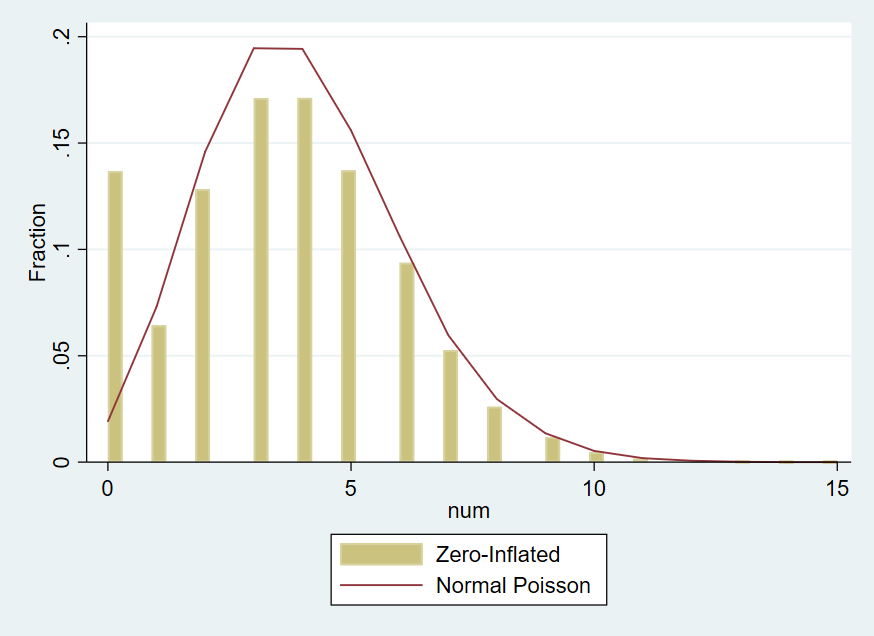

# Handling many conversions per click in modeling delayed feedback

## MPC和OPC，MPC问题有什么差异

OPC:once per click (OPC)
MPC:many per click (MPC) 

MPC（many per click）问题相对于OPC（once per click）问题的本质区别在于转化事件的多样性和不确定性。在MPC情况下，每次点击可以导致多个转化事件，这些事件可能发生的时间和价值都是不确定的，而且可能会随着时间的推移而发生变化。这种多样性和不确定性使得MPC问题相对复杂，因为需要考虑如何有效地预测多个转化事件的数量和价值，以及如何处理它们的时间延迟。

相比之下，OPC问题相对简单，因为每次点击只会导致一个转化事件，这种情况下转化事件的数量和价值相对更容易预测和处理。

| 问题 | 描述 | 问题类型|建模方法 | loss
|  ----  | ----  | ---- | ---- | ---|
| MPC(many per click) | 每次点击多个转化事件{y1,y2,y3..yn}，转化事件{yi}分布各不同 | 回归问题离散值Count|传统机器学习方法| PossionLoss，或者MSE loss|
| OPC(once per click) | 每次点击发生单个转化事件y|分类问题|深度神经网络|BinaryCrossEntroy loss|
| watch time | 单个事件（观看）的属性（时长） |回归问题| 加权分类问题, 参考youtube方法| BinaryCrossEntroy loss|

*为什么深度神经网络只用于分类问题？*

深度神经网络引入激活函数作用是实现特征空间的非线性变化（扭曲），换句话说，就是在带激活函数的隐藏层作用下，可以对特征空间进行非线性变化，最终使得数据线性可分。

## 泊松回归模型(Possion regression)

https://zh.wikipedia.org/zh-hans/%E6%B3%8A%E6%9D%BE%E5%9B%9E%E5%BD%92

泊松分布数学公式：log(E(Y|X)) = alpha + beta'X, 

泊松回归假设: Y是泊松分布，并且假设它的期望的对数可由一组未知参数进行线性表达。

泊松分布应用：

- Y是Count（计数）形式：包括事件发生的次数，比如客服中心一星期接到电话次数。Y有一个固定windows的计数。

- Y是比率数据，即事件发生次数和测量时间或者测量范围的比值，表示单位时间内该事件发生次数。

   log(E(Y|X)/exposure) = beta’x

- 适用条件：服从泊松分布的变量，具有期望和方差相等的特征。如果观测样本的方差远大于期望值的时候，则认为存在过度离势，模型不适用。通常采用 负二项分布来建模

- 常见问题：零膨胀 zero-inflated model。如果观测样本中存在大量0，则取值为0的频率原大于理论概率. 比如：一组人一小时吸烟情况, 用zero-inflated model. Zero-inflated Possion model(ZIP) 

    公式定义:https://inla.r-inla-download.org/r-inla.org/doc/likelihood/zeroinflated.pdf

    ZIP model的一个case:

    

